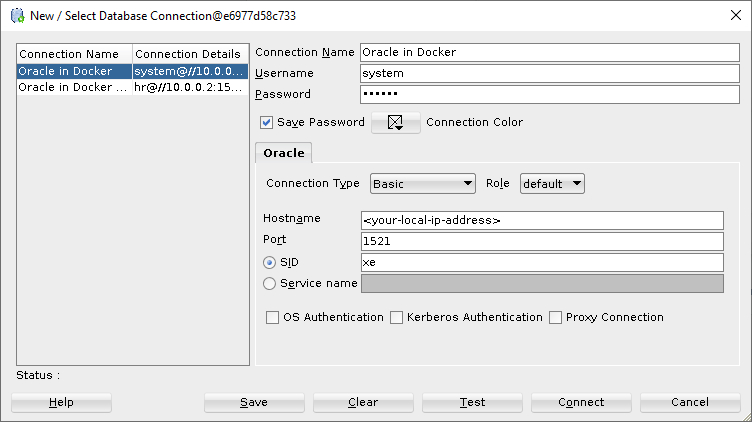

# Oracle xe 11g in Docker

This repository contains the following components running inside docker containers:

- [**Oracle xe 11g database**](https://www.oracle.com/technical-resources/articles/database/sql-11g-xe-quicktour.html) - ([docker image](https://hub.docker.com/r/gvenzl/oracle-xe))
- ~~[**SQLDeveloper from Oracle**](https://www.oracle.com/database/sqldeveloper/) - ([docker image](https://hub.docker.com/r/usersina/sqldeveloper))~~

Due to performance reasons, SQLDeveloper is not installed.
It is easier to use [Oracle Developer Tools for VS Code](https://marketplace.visualstudio.com/items?itemName=Oracle.oracledevtools).

## Main Features

- Starter HR data is already configured
- Database in container is fully stateful

## Motivation

During my undergraduate studies of computer science, I was required to use OracleDB for my SQL courses.
The installation process has always been a bit of a hassle, especially considering the only available free version is the [11g version](https://www.oracle.com/database/technologies/xe-downloads.html) which is quite outdated by now.

Having enrolled in an Engineering University for Computer science and not wanting to face the same experience again, I decided to run it all in docker containers and get on with life.
And potentially helping people who face the same issue in the future.

## Note

I that it's not really that practical to run SQLDeveloper in a container (slight VNC server lags among other reasons) therefore I just ignore the service run by adding [`profiles[0]=donotstart`](./docker-compose.yml#26) to the service configuration.

Now I simply use it to run **Oracle xe 11g** with the **HR** database.

## Getting started

This guide was tested on Windows with git bash and on Linux running PopOS 22.04

```bash
make up

# This might take a while, tail the logs with
docker logs -f oracledb
```

And you're all good! Simply use the following credentials to connect to your oracle database as shown in the screenshot with the password being `oracle`.

E.g. logging in with SQLDeveloper


- To stop the containers without deleting any data

```
make down
```

Note that this will neither delete your OracleDB data nor your SQLDeveloper pereferences.
In order to do just that, you would have to

```bash
make delete
```

## Initializing databases

<details>

<summary>This step is not needed anymore since it's added to the compose file.</summary>

## II. Extra setup

You might also want to unlock the HR account to have access to the [HR (or Human Resources) schema](https://www.webucator.com/article/oracles-demo-hr-schema/) which is just a collection of useful tables often used for testing.

### 1. Unlocking HR

HR and a bunch of other tables are now unlocked by default.

To use it simply

- Enter into the running container with the system account

```bash
make shell
```

- Connect with the HR account

```bash
sqlplus HR/HR
```

You can now run queries against the HR database

```SQL
SELECT TABLE_NAME FROM USER_TABLES;
```

</details>

## Accounts

To connect to the database outside the docker network:

```bash
Hostname: localhost
Port: 1521
SID: xe
```

- Default system account

```
user: system
password: oracle
```

- HR account (password is case sensitive)

```
user: HR
password: HR
```

## Troubleshooting

- **SQLDeveloper:** If you still have a "flashing screen" and the container exists, see the bottom section [docker hub link of sqldeveloper](https://hub.docker.com/r/marcelhuberfoo/sqldeveloper) to see how to solve it.
  You might also want to delete the `./tmp` directory if it was created by docker and create it yourself. To test, you can simply re-run `make start`

- **Ports are not available:** Either the port is in use or it is excluded by the system. See [this](https://github.com/docker/for-win/issues/9272#issuecomment-731847321) and [most importantly this](https://superuser.com/a/1610009/1024072) for windows.

## Roadmap

- [x] [Add persistance for the database](https://stackoverflow.com/a/65409258/10543130)
- [x] [Auto detect platform](https://stackoverflow.com/questions/394230/how-to-detect-the-os-from-a-bash-script)
- [x] Expose a VNC Server instead of X11
- [x] [Add sample data and HR table on init](https://hub.docker.com/r/gvenzl/oracle-xe)
